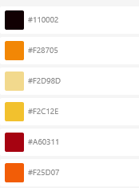
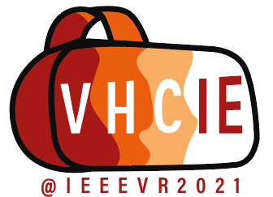
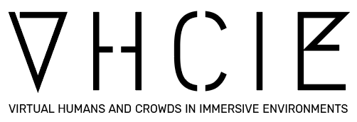
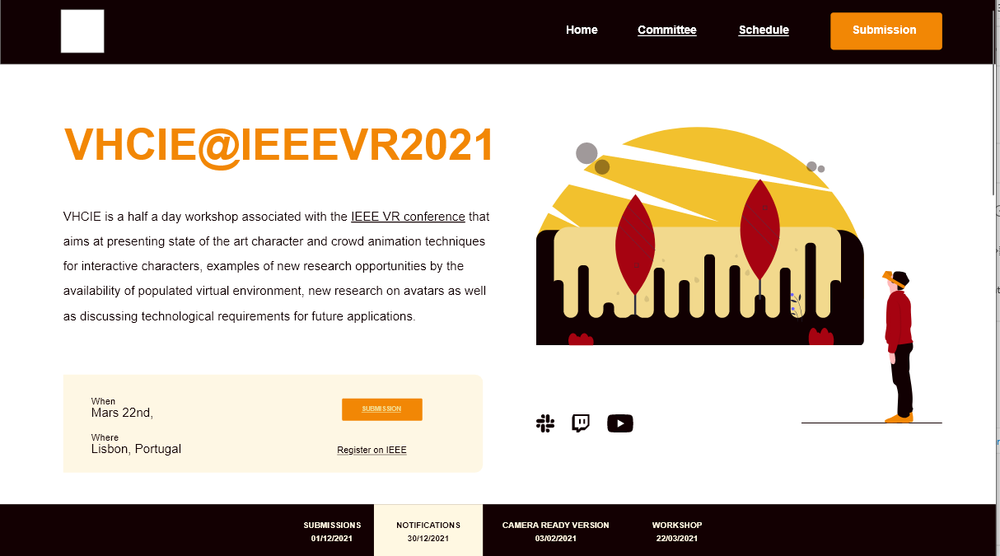
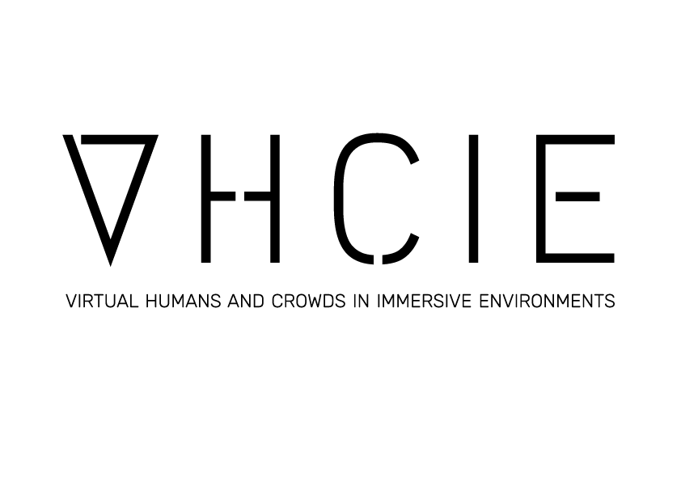
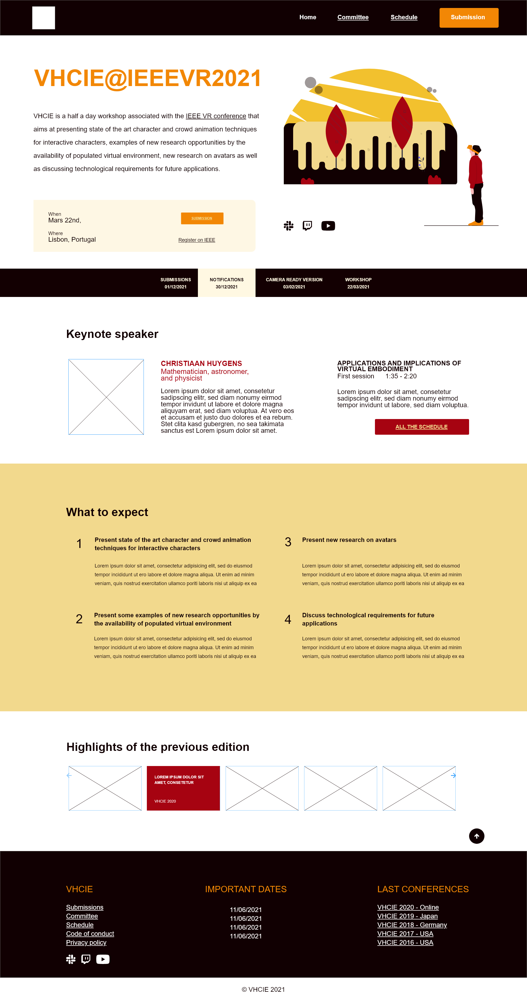
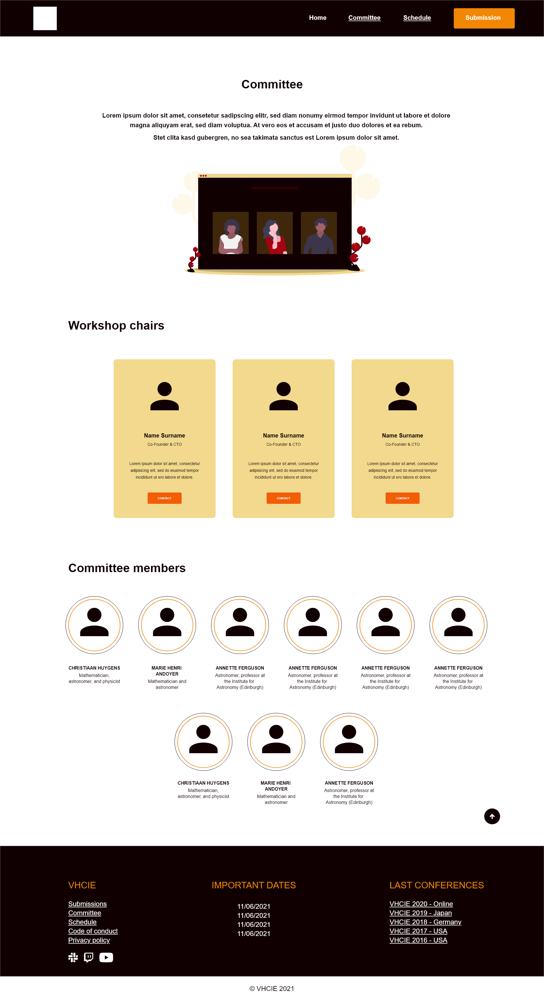
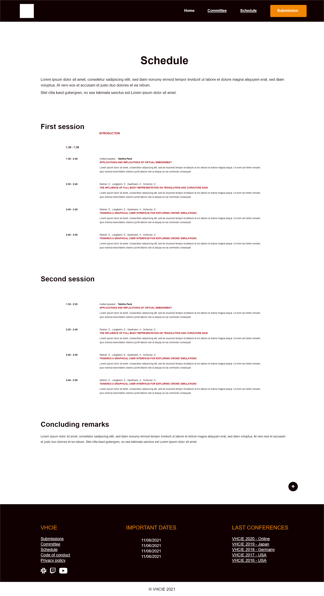
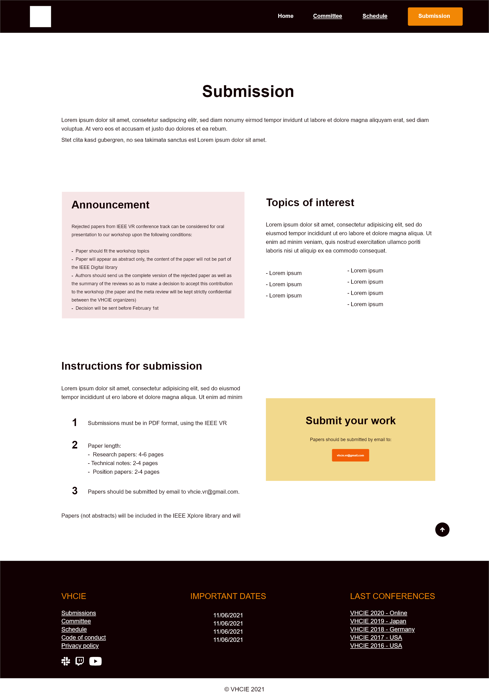

# VHCIE - My Digital Week 2020

Dans le cadre de notre deuxième année d'étude à My Digital School Rennes une semaine est concacrée à la réalisation d'un projet pour un client. Cette année c'est Anne-Hélène Olivier chercheuse au sein du laboratoire M2S de l'université de Rennes 2.

4 équipes (formées au sein de la promotion) disposeront de 4 jours pour réaliser un site web & présenter leur réalisation.  
La cliente choisira le projet qu'elle a préféré parmis les différents projets présentés. 

Elle souhaite créer un site web pour un événement international, le [VHCIE](https://sites.google.com/view/vhcieieeevr2020/home
) édition 2021.

Le workshop VHCIE (Virtual Humans and Crowds in Immersive Environments) est un  workshop organisé dans le cadre de la conférence internationale annuelle [IEEE Virtual Reality](http://ieeevr.org/2020/), conférence majeure du domaine. Cet atelier d’une demi journée a pour contexte général les travaux concernant l’interaction entre un utilisateur avec des foules et humains virtuels dans des environnements immersifs. Il vise à générer des discussions sur des techniques d'animation de ces humains virtuels interactifs,   de nouvelles recherches sur les avatars et sur les besoins pour les applications futures.  
Comme d’autres ateliers, il s’agit d’un événement satellite de la conférence IEEE VR et qui a pour participants des académiques intéressés par la recherche sur les interactions entre  un utilisateur et des humains virtuels. Avec une audience d’une cinquantaine de  spécialistes, il offre la possibilité aux auteurs de soumettre leurs travaux de recherche (qui s’inscrivent dans les thématiques de l’atelier) et d’assister à des présentations dispensées par un invité reconnu du domaine.

Le site doit permettre aux visiteurs de trouver facilement les informations importantes comme les dates des workshop, le lieu, les différents intervenants & permettre aux chercheurs de trouver les moyens de soumettre (via mail) leurs travaux avant l'évenement.

Notre équipe est constituée de 4 membres : 

* **Amélie Nicoux** : [LinkedIn](https://www.linkedin.com/in/amelienicoux/), [Behance](https://www.behance.net/amelienicoux)  
* **Thoma Decroux-Menier** : [LinkedIn](https://www.linkedin.com/in/thoma-decroux-menier/), [Behance](https://www.behance.net/thomadecroux)
* **Joanel Charicaul** : [LinkedIn](https://www.linkedin.com/in/charicauth-joanel/), [Behance](https://www.behance.net/cryj)  
* **Alexis Hutin** (moi même) : [LinkedIn](https://www.linkedin.com/in/alexis-hutin/)  

## Jour 1 : 2 Juin 2020
Pour ce premier jour de My Digital Week, nous avons commencé par organiser les tâches en fonction des affinités de chacun.  
Nous avons donc choisi de nous organiser comme ceci : 
* Thoma : Chef de projet & Designer
* Amélie : Designer/Intégrateur
* Alexis : Développeur/Intégrateur
* Joanel : Designer & Développeur/Intégrateur

Nous avons également décidé de suivre cet emploi du temps :
* Mardi : Réflexion & début de travail sur le prototype ainsi que le logo
* Mercredi : Continuer le travail sur le prototype & commencer l'intégration/développement
* Jeudi : Terminer l'intégration/développement, le logo & mettre en page la charte graphique
* Vendredi : Préparation de la présentation au client & présentation

Nous avons choisi les couleurs du projet : 

& fait deux propositions de logo : 

Nous avons également commencé à travailler sur le design de la page principale :

  

___
## Jour 2 : 3 Juin 2020

Nous avons commencé la journée en consultant notre client afin de récolter son avis à propos des premiers jets de logos que nous avions créés la veille.  

Suite à sa réponse rapide nous avons corrigé le deuxième logo, celui qui lui plaisait le plus, et nous avons donc clôturé la création de logo.  

Le logo final est donc celui ci : 

  

En parallèle nous avons presque finalisé les maquettes de toutes les pages.

 
 
 

Grace à l'avancement des maquettes l'intégration a pu commencer aujourd'hui. 
La structure de toutes les pages est en place, il ne nous reste plus qu'à travailler sur les feuilles de style.

***
## Jour 3 : 4 Juin 2020
---
## Jour 4 : 5 Juin 2020
---
## Résultats
---
## Conclusion
